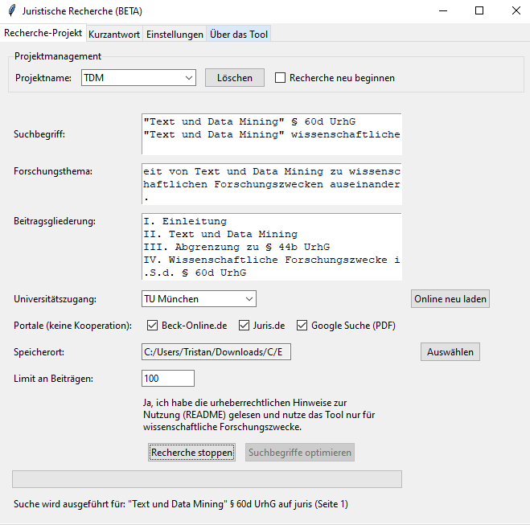
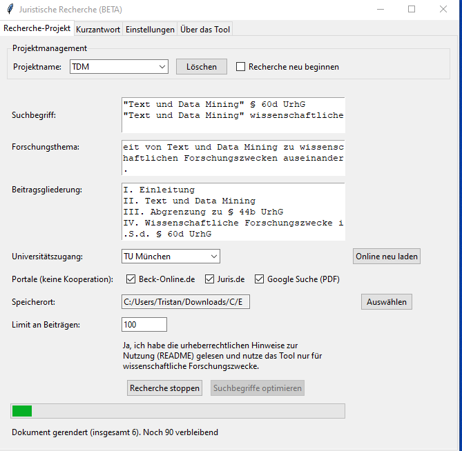
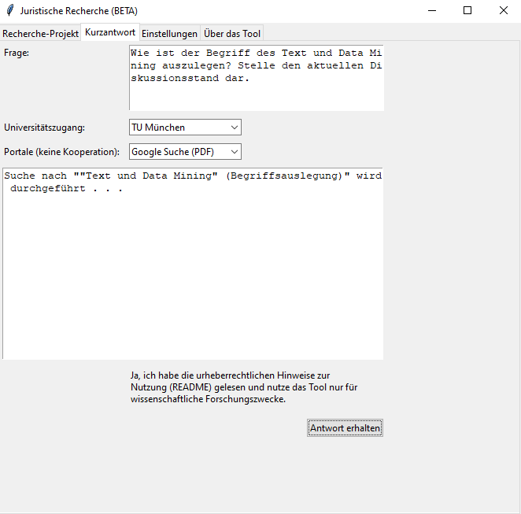

# JuraRechercheKI Version 0.9.0.
Das Tool ermöglicht die KI-gestützte juristische Recherche. Anhand von vorgegebenen Suchbegriffen werden Suchen auf den unterstützten juristischen Portalen durchgeführt, sofern der Nutzer Zugang zu den Portalen hat (z.B. im VPN).
Die geladenen Quellen werden KI-gestützt auf deren Relevanz insgesamt (1-3) und für einzelne Gliederungspunkte ausgewertet. Außerdem werden besonders relevante Fußnoten aus dem Dokument ausgelesen und ebenfalls berücksichtigt.
Alle Dateien werden als Links sowie ein Literatur-Überblick als .txt im gewählten Projektordner gespeichert.

JuraRechercheKI ist in der BETA-Version und soll vor allem die Innovationspotenziale in der Rechtswissenschaft aufzeigen, wie sie dargelegt wurden in der Abhandlung ZGE 17 (2025), 1 (https://www.mohrsiebeck.com/artikel/das-urheberrecht-als-kiinnovationsbremse-in-der-rechtswissenschaft-101628zge-2025-0002/).



**Hintergrund des Tools**
Das Tool will den Einsatz von KI-gestützter Recherche in der Rechtswissenschaft allen ermöglichen, die bereits Zugriff auf die unterstützten juristischen Portale haben.

**Beachtung des Urheberrechts (s. hierzu ZGE 17 (2025), 1)**
Das deutsche Urheberrecht erlaubt Text und Data Mining für wissenschaftliche Forschungszwecke (§ 60d UrhG) und darf nicht durch technische Schutzmaßnahmen vereitelt werden (§ 95 Abs. 1 Nr. 11 UrhG). Für kommerzielle Zwecke gelten Einschränkungen (§ 44b UrhG).

JuraRechercheKI selbst legt keine dauerhaften Vervielfältigungen an. Es benötigt im Einsatz nur temporäre Vervielfältigungen und legt lediglich Links zu den jeweiligen Dokumenten dauerhaft im Projektordner ab. Abhängig davon, welche KI-Schnittstelle zum Einsatz kommt, kann es zu weiteren, dauerhaften Vervielfältigungen kommen.

Das Tool ist vor diesem Hintergrund nur für wissenschaftliche Forschungszwecke vorgesehen. Die urheberrechtliche Zulässigkeit bedarf einer Prüfung im Einzelfall unter Berücksichtigung der Nutzungshandlungen (z.B. Vervielfältigungen in Abhängigkeit von der gewählten KI-Schnittstelle).

Zwischen jeder Abfrage liegen mehrere Sekunden, um ein schonendes Crawling sicherzustellen.

**Installation**
1. Code herunterladen und an geeigneter Stelle (z.B. Dokumente) entpacken.
2. [Python installieren](https://www.python.org/downloads/)
3. Abhängigkeiten (und Playwright Browser) installieren.
- Windows:
	
		```bash
		cd pfad
		pip install -r requirements.txt
		playwright install chromium
		```

- Linux
		
		```bash
		cd pfad-zum-ordner
		pip3 install -r requirements.txt
		playwright install chromium
		```
4. Programm starten

**Einrichtung**
1. Tool starten
2. Es öffnet sich der Tab "Einstellungen". Hier sind anzugeben:
- OpenAI-API-URL: Hier kann jede beliebige URL angegeben werden, die auf Basis der OpenAI-API-Struktur basiert. Das ermöglicht z.B. den lokalen Einsatz von OLlama.
- OpenAI-API-Key: Sofern ein Key benötigt wird, ist er hier anzugeben.
- Proxy-URL: Sofern die jeweilige Universität einen Proxy benötigt, kann dieser hier angegeben werden. Z.B. https://proxy.universitaet.de:8000
- (Optional, benötigt für Google PDF-Suche): Pfad zum Programm Poppler (PDF Verarbeitung), s. https://github.com/oschwartz10612/poppler-windows/releases
- (Optional, benötigt für Google PDF-Suche): Pfad zum Programm Tesseract (OCR), s. https://github.com/UB-Mannheim/tesseract/wiki

**Einsatz des Tools: Recherche**
1. Vor dem Einsatz: Einwahl in das jeweilige Universitäts-VPN
2. Tool starten
3.
- Option 1: Neues Rechercheprojekt anlegen:
- Projektnamen vergeben
- Suchbegriffe: einer pro Zeile; wird direkt für die Suche verwendet; Parameter (z.B. "", UND) sind möglich, soweit die ausgewählten Portale diese unterstützen. Durch Klick auf "Suchbegriffe optimieren" wird das KI-System die Begriffe durch neue Vorschläge ersetzen.
- Forschungsthema: 1-2 Sätze. Wird als Eingabekontext an das KI-System übergeben, welches die Relevanz eines Beitrags für das Thema einschätzt.
- Beitragsgliederung: 1 Gliederungspunkte pro Zeile (z.B. "A. Einleitung"). Wird an das KI-System übergeben, um für jeden Gliederungspunkt relevante Abschnitte aus Beiträgen zu identifizieren.
- Universitätszugang: Die eigene Universität. Die Zugänge werden über jura-recherche.de bzw. die Elektronische Zeitschriftenbibliothek berücksichtigt, um aus Beiträgen der Suchergebnisse Fundstellen aus den Fußnoten über weitere Portale ebenfalls abrufen zu können. Das betrifft auch Portale, die nicht unter dem Punkt "Portale" genannt sind (s. jura-recherche.de für alle unterstützen Portale).Durch Klick auf "Online neu laden" werden die Zugänge von jura-recherche.de neu heruntergeladen und aktualisiert (nur selten erforderlich).
- Portale: Auf diesen Portalen werden die Suchen mit den Suchbegriffen durchgeführt. Max. 1-2 Ergebnisseiten werden berücksichtigt.
- Speicherort (Ordner): Dort werden die Links zu den recherchierten Beiträgen abgelegt. Nicht abrufbare oder lesbare Beiträge werden als "CHECK_..."-Dateien gespeichert. "LITERATUR.txt" enthält einen Überblick über die Beiträge und deren Relevanz für das Forschungsthema, kategorisiert nach Gliederungspunkten. "WEITERE-LITERATUR.txt" enthält Fundstellen, die keinem Portal zugeordnet werden konnten und daher nicht abgerufen wurden.
- Limit an Beiträgen: Die Recherche endet, sobald diese Anzahl an Ergebnissen erreicht wurde. Es sollte mit einem geringen Wert begonnen werden (z.B. 10).
- Option 2: Bestehende Recherche fortsetzen: Das ausgewählte Projekt wird, soweit möglich, fortgesetzt. Mit "Recherche neu beginnen" kann ein Neustart erzwungen werden.
4. Recherche starten/fortsetzen:
- Login-Aufforderung: Abhängig von den Zugängen der eigenen Universität kann ein Login erforderlich sein. Der Login ist in dem geöffneten Browser-Tab vorzunehmen, dieser Tab sollte nicht geschlossen werden.
- Das Tool führt zunächst auf allen ausgewählten Portalen die Suchen mit allen Suchbegriffen durch.
- Sodann fragt das Tool alle Links aus den Suchergebnissen (1-2 Suchergebnisseiten) ab und fordert vom KI-System eine Einschätzung der Relevanz sowie der relevanten Fußnoten an. Der Link zum Beitrag und die Relevanzeinschätzung werden gespeichert. Die Fußnoten werden ebenfalls in die Liste der weiteren Ergebnisse aufgenommen, soweit die Fundstelle/Zeitschrift einem Portal zugeordnet werden kann.
- "Noch verbleibend" kann zu Beginn geringer sein als das "Limit an Beiträgen". Erst wenn mehr und mehr Fußnoten ausgewertet und aufgenommen werden, steigt der Wert bis zum eingebenen Limit an Beiträgen.



**Einsatz des Tools: Kurzantwort**
1. Vor dem Einsatz: Einwahl in das jeweilige Universitäts-VPN
2. Tool starten
3. Juristische Fragestellung eingeben, Universität und Portal auswählen.
4. Antwort erhalten:
- Das Tool fragt das KI-System nach einem passenden Suchbegriff.
- Die Suche wird durchgeführt.
- Der Text aus dem ersten Suchergebnis (d.h. ein Beitrag) wird an das KI-System übergeben.
- Das KI-System gibt eine Antwort unter Berücksichtigung des Beitrags (oder ohne, sofern kein passender gefunden werden konnte) zurück.


